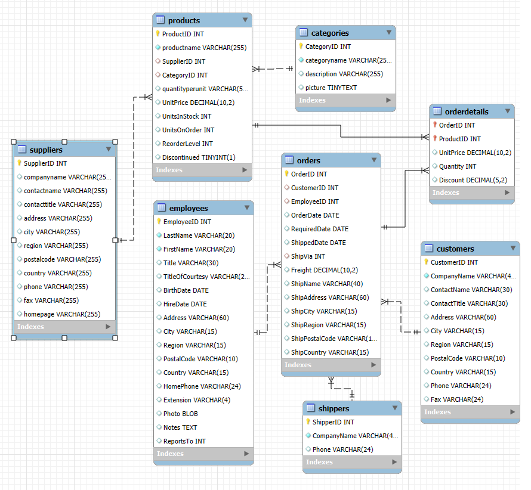

# Prueba técnica de Intcomex / Api-Rest con Spring Boot

# Tabla de Contenidos

1. [Introducción](#introducción)
2. [Estructura del Proyecto](#estructura-del-proyecto)
    * [Arquitectura](#arquitectura)
    * [Capas del Proyecto](#Capas)
4. [Recursos](#recursos)
	* [Cuentas](#cuentas)
	* [Usuarios](#usuarios)
	* [Movimientos](#movimientos)
	* [Categorías](#categorías)
5. [Test](#test)

---

# Introducción

Se presenta un API para ofrecer información sus clientes, así como procesos internos, se cuenta con el siguiente modelo de base de datos (MER)

con base a este modelo se crea la DB así como una API REST, hostear esa API en un cloud computing libre (Google App Engine,Amazon AWS) y se crean los siguientes servicios:

* [Crear Categoría ( POST /Category/)](#Crear-Categoria)
* [Crear Producto (  POST    /Product/)](#Crear-Productos)
* [listar productos ( GET	/Products/)](#Listar-Productos)
* [listar productos por ID (GET    /Products/id/)](#Listar-Productos-por-ID)

Todas las respuestas a las peticiones son devueltas en formato JSON.

Para ver el apartado completo sobre los recursos mencionados haga click [aquí](#recursos).

---

# Estructura del proyecto
Para crear una solución  que cumpla con los requisitos mencionados, se realiza una implementación utilizando Spring Boot, un framework robusto para desarrollar aplicaciones Java, que es ideal para construir APIs REST. Se describe el diseño de la arquitectura, las buenas prácticas aplicadas, y el código estructurado de forma entendible. Luego, se describen consideraciones de rendimiento, seguridad, y pruebas.

## Arquitectura 
Para la solución se determina la adopción del patrón de arquitectura de N capas por su modularidad, agilidad en su implementación y con el fin de optimizar rendimiento y seguridad es decir para tener control y orden sobre el código/lógica de negocio de la aplicación, por seguridad y control sobre los datos en la aplicación. Elegir una arquitectura de N capas también permite que la aplicación escale fácilmente y maneje grandes cantidades de datos.
También se utiliza el patron DTO (Data Transfer Object) con el fin de solo exponer data necesaria, mas no las entidades.

### Capas
* Common: Contiene el manejo de excepciones y paquete de utilerias.
* Controller: Maneja las peticiones HTTP (REST API), en un subdirectorio rest, y en advice controlamos todos los errores generados en la apliación (ControllerAdvice).
* Model: En la capa de modelo todas las peticiones se van a hacer a través de interfaces (inversión de dependencias: la lógica no depende de implementaciones si no de abstracciones).
* Service: Lógica de negocio.
* Repository: Interacción con la base de datos usando JPA/Hibernate.
* DTOs: Clases de transferencia de datos entre las capas.
* Entity: Representa las tablas en la base de datos.

___
